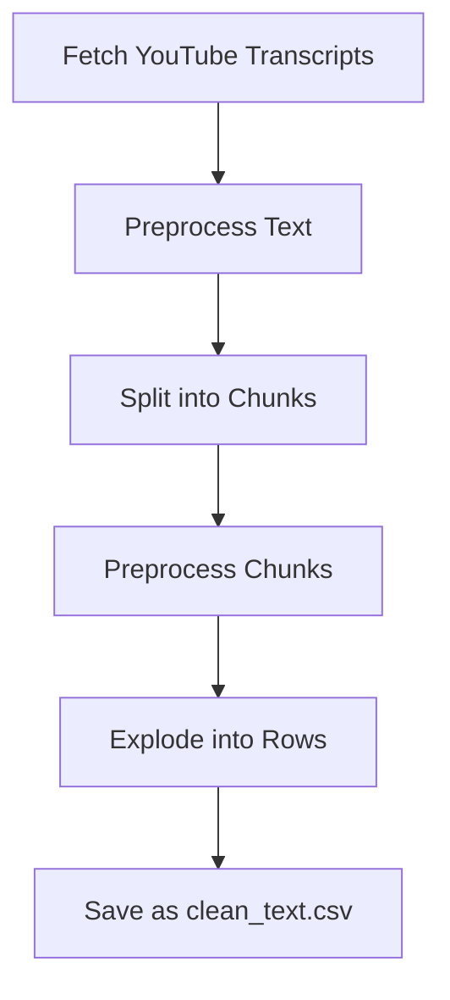
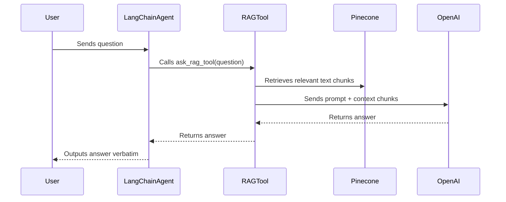

# 🤖 Building a CompTIA Security Exam Personalized Tutor Chatbot Project

---

## Executive Summary
This project focuses on **Interactive Chatbot creation for Exam preparation** using **Large Language Model (LLM)**  outlines the development and evaluation of an AI-powered tutor bot designed to assist students in preparing for the **CompTIA Security+ SY0-701 certification exam**


 <li>End‑to‑end RAG‑powered CompTIA Security+ SY0‑701 Tutor Chatbot </li>
 <li>YouTube transcript ingestion, preprocessing, and chunking </li>
 <li>PDF ingestion and chunking </li>
 <li>Vector storage using Pinecone </li>
 <li>LLM‑based retrieval, response generation, mock exam system </li>
 <li>Gradio UI + LangSmith evaluation pipeline </li>

---

<!-- ===========================
     Key Files
     =========================== -->
<h2 id="files">Key Files</h2>
<table>
  <tr><th>Path</th><th>Description</th></tr>
  <tr><td><code>Notebook_files</code></td><td>Notebook of .ipynb codes</td></tr>
  <tr><td><code>Python_files</code></td><td>Python code files</td></tr>
  <tr><td><code>Resources</code></td><td>pdf files</td></tr>
  <tr><td><code>Transcript</code></td><td>Youtube video to text transcript file in csv format</td></tr>
 <tr><td><code>Presentation.pptx</code></td><td>Project Presentation</td></tr>
 <tr><td><code>Files </code></td><td>PDF files</td></tr>
 <tr><td><code>requirments.tx </code></td><td>Requirments file</td></tr>
</table>

---

## ⚡ Table Summary

| Module               | Main Role                               | Key Technologies   |
|----------------------|-----------------------------------------|-------------------|
| Videoload_cleanup.py | Fetch, clean, chunk video transcripts    | youtube-transcript-api, pandas, tiktoken |
| RAG_system.py        | Embedding, Pinecone vector DB, RAG logic| Pinecone, OpenAI, SentenceTransformers   |
| chatbot_tools.py     | LangChain agent, tool, chat orchestration| LangChain, OpenAI |
| app.py               | User interface                          | Gradio            |
| evaluation.py        | Automated evaluation and tracing        | OpenEvals, LangSmith, pandas             |


---

<!-- Badges (images linked) -->
<h3>🧩 Core Dependencies & Libraries</h3>

<p>
  
  
  
  
  
  
  
  
  
  
  
  
</p>

<ul>
  <li>Python 3.10 or higher</li>
  <li>FastAPI == 0.123.0</li>
  <li>LangChain (multiple modules): langchain, community, openai</li>
  <li>Transformers == 4.57.3</li>
  <li>PyTorch == 2.9.1</li>
  <li>Pandas == 2.3.3</li>
  <li>NumPy == 2.3.5</li>
  <li>scikit-learn == 1.7.2</li>
  <li>Pinecone Client == 6.0.0</li>
  <li>OpenAI SDK == 2.8.1</li>
  <li>HuggingFace Hub == 0.36.0</li>
  <li>Gradio == 6.0.1</li>
</ul>

<br />

<h3>📦 Full Requirements (from requirements.txt)</h3>

<p>Your project includes many supporting packages for ML, async APIs, vector DBs, model loading, dataset processing, and web serving.  
Full list is included below:</p>

<details>
<summary><strong>📜 Click to expand full dependency list</strong></summary>

<pre>
aiofiles==24.1.0
aiohappyeyeballs==2.6.1
aiohttp==3.13.2
aiosignal==1.4.0
annotated-doc==0.0.4
annotated-types==0.7.0
anyio==4.12.0
appdirs==1.4.4
... (all other dependencies from your requirements.txt)
</pre>

</details>

<br />

<h3>🧩 Project Requirements</h3>
<ul>
  <li>Python environment with all dependencies installed</li>
  <li>Your application source code</li>
  <li>API keys (if required — OpenAI, Pinecone, HF Hub, etc.)</li>
</ul>


---

# 📚 Chatbot Project Documentation

This documentation provides a detailed overview of the chatbot project designed for CompTIA Security+ SY0-701 exam preparation. The system leverages YouTube video transcripts and PDF documents, processes and indexes them using Pinecone, and enables interactive querying via a Retrieval-Augmented Generation (RAG) chatbot interface. The project also includes evaluation scripts to measure chatbot accuracy and relevance. 

---

## Video Transcript Loading & Preprocessing (`Videoload_cleanup.py`)

This module fetches, cleans, and chunks YouTube video transcripts for downstream semantic search and chatbot use.

### Key Steps

- **Dependency Installation**:
  - Installs packages required for YouTube transcript retrieval and text processing.

- **YouTube Transcript Fetching**:
  - Uses `youtube-transcript-api` to fetch English transcripts for video IDs.
  - Skips videos without English transcripts.

```python
def get_english_transcript(video_id: str) -> str | None:
    try:
        data = api.fetch(video_id, ["en"])
        return " ".join(s.text for s in data)
    except NoTranscriptFound:
        print(f"Skipping {video_id} (no English transcript)")
        return None
```

- **Transcript Preprocessing**:
  - Cleans up special characters, removes `[Music]` tags, and standardizes whitespace.
  - Uses `tiktoken` for tokenization.

- **Chunking and DataFrame Creation**:
  - Splits transcripts into ~400-token chunks using `RecursiveCharacterTextSplitter`.
  - Preprocesses each chunk.
  - Explodes chunks into separate DataFrame rows, adding chunk numbers.

- **Export**:
  - Saves the processed DataFrame as `clean_text.csv` for use in the RAG system.

### Data Processing Flow



---

## Vector Database and Retrieval System (`RAG_system.py`)

This script orchestrates the core RAG workflow, including embedding generation, vector database management, and advanced QA logic.

### Main Responsibilities

- **Dependency Installation & Imports**:
    - Ensures all required libraries are present for Pinecone, OpenAI, transformers, and PDF extraction.

- **API Key Management**:
    - Loads OpenAI and Pinecone API keys from environment variables for secure access.

- **Pinecone Index Initialization**:
    - Creates or connects to a named Pinecone index (`indexfp`).
    - Configures the vector dimension (768) and similarity metric (cosine).

- **Embedding Model Setup**:
    - Loads a `SentenceTransformer` (`BAAI/bge-base-en-v1.5`) for semantic text embeddings.
    - Uses GPU if available.

- **Transcripts Embedding & Upserting**:
    - Assigns unique IDs to each text chunk.
    - Embeds each chunk, then upserts to Pinecone with metadata.

- **PDF Ingestion, Chunking & Embedding**:
    - Reads all PDFs from a folder, extracts text per page.
    - Chunks each page's text, attaches metadata.
    - Embeds and upserts all PDF chunks into the same Pinecone index.

- **User Query & RAG Workflow**:
    - Embeds user queries, retrieves top-K relevant chunks from Pinecone.
    - Constructs context for OpenAI GPT-4o-mini model.
    - Specialized logic for mock exam creation, grading, and explanations.


### Advanced Chatbot Logic

- **Mock Exam Generation**: Recognizes requests for mock/practice exams and generates realistic, balanced multiple-choice sets (20-30 questions), excluding answers and explanations.
- **Exam Grading and Feedback**: Detects answer submission, grades responses, provides explanations, and gives scoring, including exam duration calculations.
- **Standard RAG QA**: For general queries, retrieves relevant context from Pinecone and answers using the LLM, extending with its own knowledge as needed.

---

## Tool, memory & Chatbot Orchestration (`chatbot_tools.py`)

This module integrates the RAG pipeline into a tool-using agent via LangChain.

### Key Components

- **LangChain Agent Setup**:
    - Defines the `ask_rag_tool`, which invokes the main `ask` function from the RAG system.
    - Assembles an agent with a prompt template enforcing strict tool use: all answers must be returned exactly as produced by the RAG tool (no rewriting or summarization).

- **Conversation Memory**:
    - Uses `ConversationBufferMemory` to remember the dialogue context.

- **Chat Interface Logic**:
    - The `chat()` function invokes the agent and extracts the full, tool-generated answer for display.

### Agent-Tool Interaction Diagram



---

## Gradio Web Application (`app.py`)

This script provides a user-friendly chat interface for interacting with the Security+ Tutor Bot.

### Features

- **Initial Greeting**:
    - Greets users and introduces the chatbot's purpose.

- **Message Memory**:
    - Tracks conversation history for a smoother chat experience.

- **Chat Function (`chat_fn`)**:
    - Processes user inputs, updates history, calls the chatbot, and appends assistant responses.

- **Gradio Blocks UI**:
    - Markdown instructions.
    - Chatbot window (500px tall).
    - Input textbox and send button.
    - State synchronization for history.

- **Event Handling**:
    - Handles both send button clicks and pressing Enter.


---

## Evaluation Framework (`evaluation.py`)

This module automates evaluation of the chatbot's factual correctness, relevance, and similarity to reference answers.

### Features

- **Environment Setup**:
    - Loads API keys and tracing/project info for LangSmith and OpenAI.

- **Test Cases**:
    - Defines a set of representative user questions and expected ("ground truth") answers.

- **Evaluators**:
    - **Correctness**: Uses an LLM-as-judge via OpenEvals to score factual accuracy.
    - **Relevance**: Measures word overlap between question and answer.
    - **Similarity**: Computes a similarity ratio against the ground truth answer.

- **Evaluation Loop**:
    - Calls the chatbot for each test question.
    - Collects the prediction, computes metrics, and stores results.

- **Result Upload**:
    - Pushes evaluation runs and feedback to LangSmith for tracking and analysis.

---

## Data Structures

### Cleaned Video Transcripts CSV

| video_id   | chunk_number | Processed_Text_chunk |
|------------|--------------|----------------------|
| YBF9c2mCGME | 1           | ...                  |
| ...        | ...          | ...                  |

### PDF Chunks DataFrame

| pdf_file | page_number | chunk_index | passage_text |
|----------|-------------|-------------|--------------|
| doc1.pdf | 0           | 0           | ...          |
| ...      | ...         | ...         | ...          |


---


## System Overview

The project combines modern data ingestion, processing, and retrieval with advanced LLM prompting and agentic orchestration. It is designed for high-accuracy, context-aware responses to Security+ exam questions, with extensible evaluation and a user-friendly interface.

---


## 👨‍💻 Usage Notes

- **Before running**, ensure all API keys are set in your environment.
- **To add new data**, update the YouTube IDs or add PDFs to the `files` directory and rerun preprocessing and upserting steps.
- **Evaluation** can be customized by editing the test questions and ground truths in `evaluation.py`.


---

This documentation should enable any developer or technical stakeholder to understand, extend, and operate the chatbot project efficiently.

----
